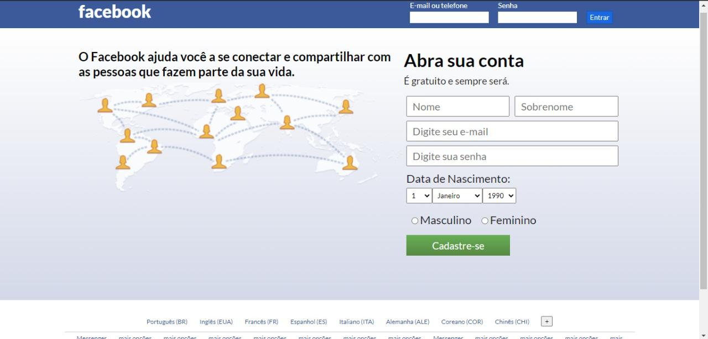

# facebookClone_LoginOld
uma aplicação front end da tela de login antiga do Facebook, Utilizando HTML, CSS e pela primeira vez o PHP.

# * 。 • ˚ ˚ ˛ ˚ ˛ • 。* 。° 。* 。 • ˚* 。 • ˚ ˚ ˛ ˚ ˛ • 。* 。° 。* 。 • ˚
### `Imagens do projeto`📷

